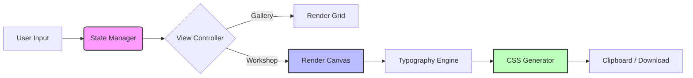

<div align="center">

# TypeForge
### Unified Typography Design & Implementation Tool

[](https://opensource.org/licenses/MIT)
[](https://github.com/Aliriyaj007/TypeForge)
[](https://github.com/Aliriyaj007/TypeForge)

**See it. Refine it. Use it.**

TypeForge is a focused, instant-utility tool that bridges the gap between typographic inspiration and production-ready implementation. It runs entirely in your browser using a single HTML file. No database, no AI, no build steps—just pure utility.

[**Direct Download**](https://github.com/Aliriyaj007/TypeForge/releases/latest/download/index.html) • [**Live Web App**](https://aliriyaj007.github.io/TypeForge/) • [**Report Bug**](https://github.com/Aliriyaj007/TypeForge/issues)

</div>

---

## 🧠 Why TypeForge?

Typography is often the most subjective and time-consuming part of design. Developers struggle to match design specs, and designers struggle to test pairings in real-world contexts.

TypeForge eliminates this friction by combining a **curated gallery** with a **precision workshop**.

| The "Before" Way | The TypeForge Way |
| :--- | :--- |
| Manually searching Google Fonts and guessing pairings. | **Curated Gallery:** Browse expert-selected pairs (Serif/Sans, Display/Body). |
| Calculating modular scales in a spreadsheet. | **Interactive Sliders:** Adjust scale ratios (1.125 - 1.618) and base sizes instantly. |
| Manually checking contrast ratios with external tools. | **Real-time Feedback:** Automatic AA/AAA contrast compliance indicator. |
| Writing CSS variables from scratch. | **One-Click Export:** Copy production-ready CSS Custom Properties instantly. |

---

## ⚡ 60-Second Quick Start

TypeForge is designed to be useful the moment you open it.

1.  **Download** the single `index.html` file or open the [Web App](https://aliriyaj007.github.io/TypeForge/).
2.  **Browse** the gallery for inspiration or enter the **Workshop** to start fresh.
3.  **Forge:** Select a Heading font and a Body font.
4.  **Refine:** Drag the sliders to adjust Scale, Line Height, and Colors. Watch the canvas update instantly.
5.  **Export:** Click "Copy CSS" and paste it directly into your project.

```bash
# Option 1: Run locally (No server required)
# Just open the file in your browser
open index.html

# Option 2: Serve via python/npx (Optional)
python3 -m http.server 8000
# Then visit localhost:8000
```

---

## 🏗️ Architecture

TypeForge is built on the principles of zero-dependency and client-side privacy. It uses a modular JavaScript pattern (IIFE) to manage state without polluting the global scope.



### Core Components
*   **The Foundational Gallery:** Starts with 20+ curated pairs. Filter by Mood (Professional, Playful, Elegant) or Use Case (Dashboard, Editorial).
*   **Precision Control Panel:** Granular control over Modular Scales, Letter Spacing, and Contrast Ratios.
*   **Live Preview Canvas:** A "Smart Stage" that renders your typography across different UI components (Hero, Article, Cards) simultaneously.
*   **Implementation Dock:** Generates clean, commented CSS using CSS Custom Properties (`:root`).

---

## 🛠️ Installation & Usage

TypeForge is strictly a static site. It can be hosted anywhere or run locally.

### Method 1: Direct Download (Fastest)
Grab the raw HTML file from the releases page.
[📥 Download Latest](https://github.com/Aliriyaj007/TypeForge/releases/latest/download/index.html)

### Method 2: Clone Repository
```bash
git clone https://github.com/Aliriyaj007/TypeForge.git
cd TypeForge
open index.html
```

### Method 3: CDN / Embed
You can embed TypeForge directly into your existing documentation or intranet.

```html
<iframe 
  src="https://aliriyaj007.github.io/TypeForge/" 
  width="100%" 
  height="800px" 
  frameborder="0">
</iframe>
```

---

## ✨ Features

| Feature | Description |
| :--- | :--- |
| **Smart Filtering** | Filter font pairs by mood, voice, and industry use-case. |
| **Modular Scale Calculator** | Automatically generate H1-H6 sizes based on ratios like Major Third (1.25) or Golden Ratio (1.618). |
| **Contrast Checker** | Real-time WCAG AA/AAA compliance checking for text/background pairs. |
| **7 Premium Themes** | Built-in UI themes (Light, Dark, Sepia, Ocean, High Contrast) accessible via the header. |
| **JSON Backup** | Save your "Forges" to a JSON file and import them later to resume work. |
| **Print Simulation** | Dedicated print view to check how typography renders on paper. |

---

## 📂 Project Structure

The project is intentionally simple to encourage hacking and modification.

```text
TypeForge/
├── index.html          # The entire application (HTML/CSS/JS)
├── README.md           # This file
└── assets/             # (Optional) Placeholder for future icons
```

---

## 🤝 Contributing

We value utility over hype. If you want to contribute:

1.  **Fork** the repo.
2.  **Create a branch** (`git checkout -b feature/AmazingFeature`).
3.  **Keep it simple:** Avoid adding heavy frameworks (React/Vue) or backend dependencies.
4.  **Commit** (`git commit -m 'Add AmazingFeature'`).
5.  **Push** to the branch.
6.  Open a **Pull Request**.

Please ensure code is readable, commented, and follows the existing vanilla JS architecture.

---

## 👨‍💻 Author & Contact

**Riyajul Ali**

*   **GitHub:** [Aliriyaj007](https://github.com/Aliriyaj007)
*   **LinkedIn:** [Aliriyaj007](https://linkedin.com/in/Aliriyaj007)
*   **Email:** [aliriyaj007@protonmail.com](mailto:aliriyaj007@protonmail.com)

---

## 📄 License

This project is licensed under the MIT License - see the [LICENSE](LICENSE) file for details.

---

<div align="center">
  <sub>Built with ❤️ and Vanilla JS by Aliriyaj007</sub>
</div>
